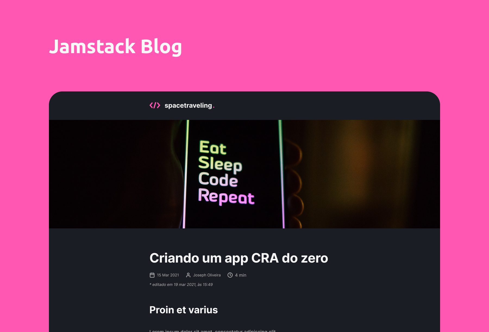

# Jamstack Blog

<p>
  
  
  
  <a href="https://opensource.org/licenses/MIT">
    
  </a>

</p>


## Tópicos

[Sobre o Jamstack Blog](#sobre-o-Jamstack Blog)

[Tecnologias](#tecnologias)

[Instalação e uso](#instalação-e-uso)

[Licença](#licença)

<br>

## Sobre o Jamstack Blog

O Jamstack Blog foi desenvolvido durante um desafio da trilha ReactJS do bootcamp Ignite. O desafio consistia em criar do zero uma aplicação de um blog com Prismic CMS a partir de um layout do Figma.

<br>

<p align="center">
  
</p>

## Tecnologias

Tecnologias e ferramentas utilizadas no desenvolvimento do projeto:

- [Next.js](https://nextjs.org/)
- [TypeScript](https://www.typescriptlang.org/)
- [Sass](https://sass-lang.com/)
- [React Icons](https://react-icons.github.io/react-icons/)
- [Prismic CMS](https://prismic.io/)

<br>

## Instalação e uso

```bash
# Abra um terminal e copie este repositório com o comando
git clone https://github.com/Brunoskyy/jamstack.git
# ou use a opção de download.

# Entre na pasta web com
cd jamstack

# Instale as dependências
yarn install

# Adicione suas variáveis de ambiente no arquivo .env.example
# e renomeie o arquivo para .env

# Rode o servidor de desenvolvimento
yarn dev
```

<br>


## Licença
<a href="https://opensource.org/licenses/MIT">
    
</a>

<br>

Esse projeto está sob a licença MIT. Veja o arquivo [LICENSE](/LICENSE) para mais detalhes.

---

Feito com :heart: by [Artur Bruno](https://github.com/Brunoskyy)

[](https://www.linkedin.com/in/artur-bruno-b8b409ba/)
[](mailto:arturbrunoferreira@gmail.com)
