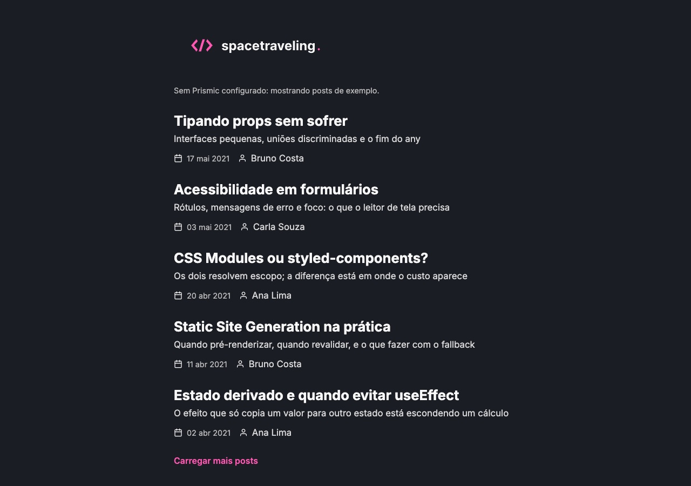

# spacetraveling


A blog on Next.js with Prismic as the CMS, built in February 2022 for a
challenge in Rocketseat's Ignite course. The brief was a Figma layout, a
Prismic repository and a test suite; the pages, the components and the data
fetching are mine. In 2026 I brought it up to the current stack so it still
runs, and gave it a way to run without a CMS account.

<p align="center">
  
</p>

## Running it

Node 24. No Prismic account is needed to see it working.

```bash
nvm use
npm install
npm run dev      # http://localhost:3000, on the example posts
```

```bash
npm test         # 13 tests, Vitest and Testing Library
npm run build    # static generation of the home and every post
```

### With Prismic

Copy `.env.example` to `.env` and set `PRISMIC_API_ENDPOINT` (and
`PRISMIC_ACCESS_TOKEN` for a private repository). The repository needs a
`posts` custom type with `title`, `subtitle`, `author`, `banner` and a
`content` group of `heading` and `body`, which is what the course's layout
expects.

### Without Prismic

When the endpoint is not set, posts come from `fixtures/posts.json` through
the same module the Prismic path uses, and the home says so in a line under
the logo. Pagination, reading time and the post pages all work on the
fixtures, so the site can be built and deployed as a demo.

## What's in it

- Static generation for the home and each post, with revalidation every
  minute and a blocking fallback for posts published after the build.
- "Load more" on the home page through a small API route, so the browser
  never talks to Prismic directly and the fixture mode paginates the same way.
- Reading time from the post body: count the words in every section, divide
  by two hundred a minute, round up, never show zero.
- Dates in Portuguese, taken in UTC so a post shows the same day wherever it
  is rendered.

## What changed in the upgrade

Next 10 stopped building on current Node because a dependency compiled into
it predates package exports. The move was to Next 16 (pages router kept),
React 19, TypeScript 5 in strict mode, and Prismic's v7 client, where the
query predicates became `getByType` and `getByUID` and `prismic-dom` was
folded into the client as `asHTML` and `asText`. The challenge's tests
mocked Next 10's router internals, so they were rewritten against what the
pages actually do rather than the shape of a mock.

## What's missing

- No comments, no preview mode, no next and previous links; those were the
  optional part of the challenge.
- The fixtures are seven posts with placeholder bodies. They exist to show
  the layout and the mechanics, not to be read.
