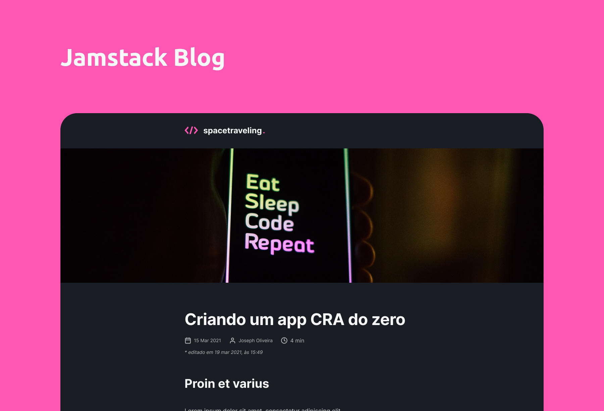

# spacetraveling


A blog on Next.js with Prismic as the CMS, built in February 2022 for a
challenge in Rocketseat's Ignite course. The brief was a Figma layout, a
Prismic repository and a test suite; the pages, the components and the data
fetching are mine, the tests came with the challenge and had to pass.

<p align="center">
  
</p>

## Running it

This is a Next.js 10 project and it builds on Node 16. The test suite runs
fine on newer Node; `next build` does not, because a dependency inside Next
10 predates package exports.

```bash
nvm use 16
yarn
cp .env.example .env   # PRISMIC_API_ENDPOINT=https://<repo>.cdn.prismic.io/api/v2
yarn dev
```

```bash
yarn test              # 11 tests, React Testing Library
```

You need a Prismic repository with a `posts` custom type holding `title`,
`subtitle`, `author`, `banner` and a `content` group with `heading` and
`body`, which is what the course's layout expects.

## What's in it

- Static generation for the home and each post (`getStaticProps`,
  `getStaticPaths` with fallback), so the site is HTML on a CDN and Prismic is
  only hit at build time or on the first request for a new post.
- "Load more" on the home page that walks Prismic's `next_page` cursor.
- Reading time computed from the post body: count the words, divide by a
  reading speed, round up.
- Dates formatted in Portuguese with date-fns.

## What's missing

- No comments, no preview mode, no "next post / previous post" links; those
  were the optional part of the challenge.
- It is pinned to Next 10 and React 17. I started an upgrade to Next 14 and
  the app itself moves easily, but the provided tests are written against
  Next 10's router internals and would need rewriting first.
